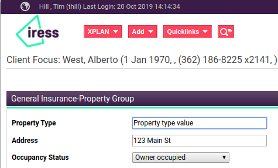
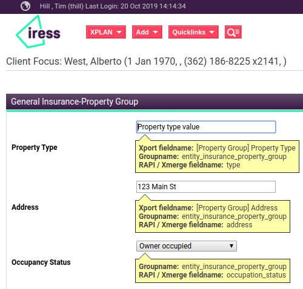

# xplanFieldRevealor

A javascript module that will help you determine xplan fieldnames.

**Transforms this**

**Into this**

## Documentation
[Documentation](https://timhill-iress.github.io/xplanFieldRevealer/index.html).

## Contributing
I'm happy to accept pull requests.

I will not allow any dependencies for the js file that is used to reveal the Xplan field information. 
This is because Xplan sites generally contains personal data, users should be able to understand what the script is doing and re-assure themselves there is no risk to their data.
