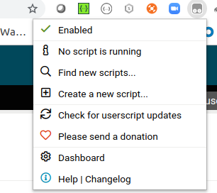
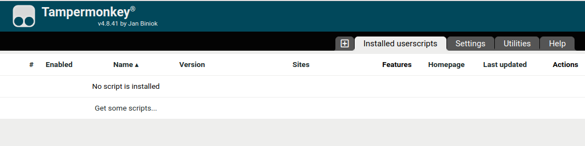
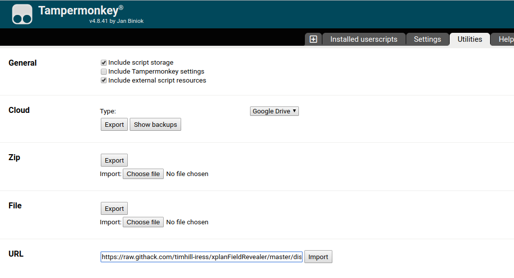
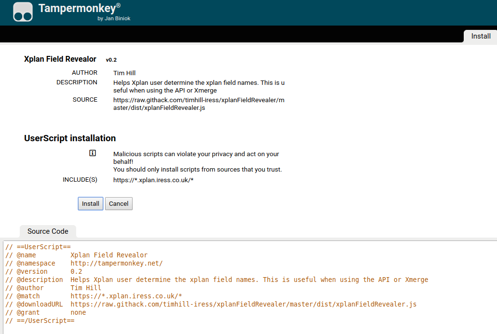

## Tampermonkey

The Tampermonkey plugin is available for several broswers, details here https://www.tampermonkey.net/

## Step by Step instructions:

1. Click the Tampermonkey plugin, select dashboard

    

2. Click on Utilities

    

3. Copy and paste this URL `https://raw.githack.com/timhill-iress/xplanFieldRevealer/master/dist/xplanFieldRevealer.js` into the URL textbox and click Import

    

4. Click Install

    

If you uncomfortable about the Tampermonkey plugin. See the [Bookmarklet instructions](bookmarklet.html).